# Diagramas UML – AppLogistica (código Mermaid) – Avance 2 (Capítulos I al VI)

Cada bloque puede pegarse en https://mermaid.live o en cualquier editor compatible con Mermaid para regenerar la imagen.

## d01_organigrama | Organigrama básico de LogiRuta Perú S.A.C.
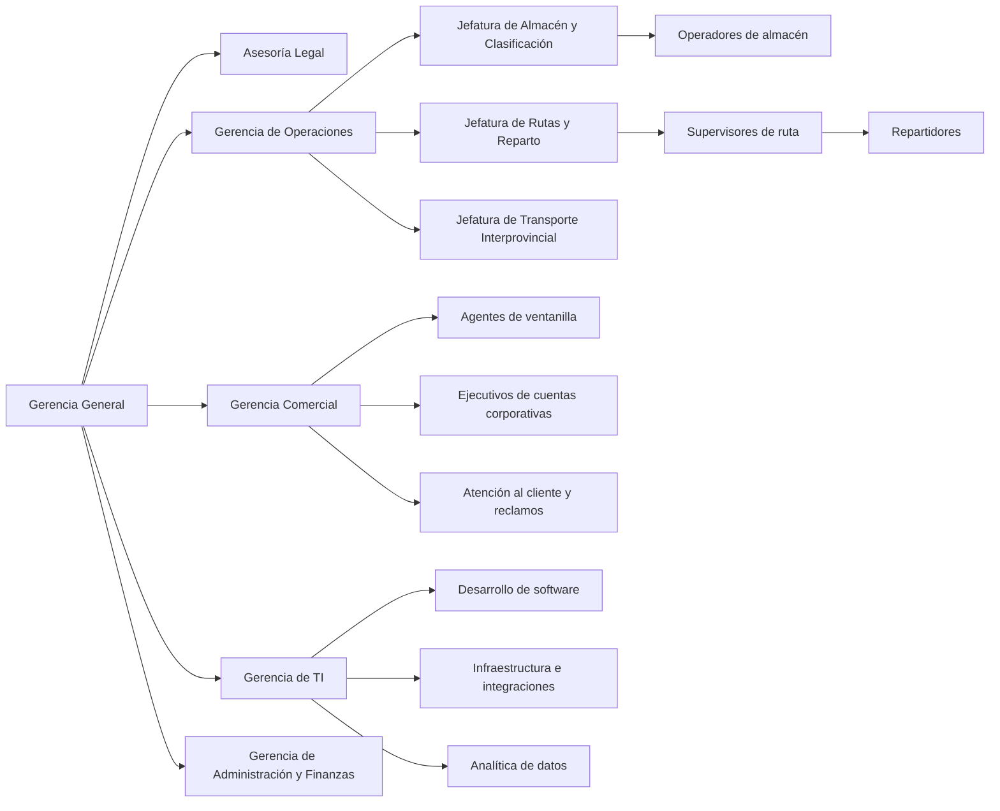
```mermaid
flowchart LR
    GG["Gerencia General"]
    GG --> AL["Asesoría Legal"]
    GG --> GO["Gerencia de Operaciones"]
    GG --> GC["Gerencia Comercial"]
    GG --> GTI["Gerencia de TI"]
    GG --> GAF["Gerencia de Administración y Finanzas"]
    GO --> JA["Jefatura de Almacén y Clasificación"]
    GO --> JR["Jefatura de Rutas y Reparto"]
    GO --> JI["Jefatura de Transporte Interprovincial"]
    JA --> OA["Operadores de almacén"]
    JR --> SR["Supervisores de ruta"]
    SR --> RP["Repartidores"]
    GC --> AV["Agentes de ventanilla"]
    GC --> KAM["Ejecutivos de cuentas corporativas"]
    GC --> SAC["Atención al cliente y reclamos"]
    GTI --> DS["Desarrollo de software"]
    GTI --> INF["Infraestructura e integraciones"]
    GTI --> BI["Analítica de datos"]
```

## d02_estados | Ciclo de vida de un envío (diagrama de estados)
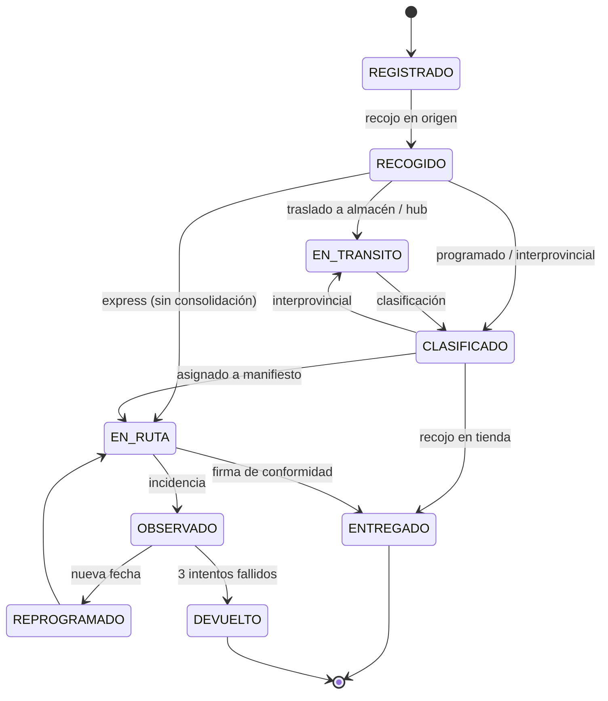
```mermaid
stateDiagram-v2
    [*] --> REGISTRADO
    REGISTRADO --> RECOGIDO : recojo en origen
    RECOGIDO --> EN_TRANSITO : traslado a almacén / hub
    RECOGIDO --> EN_RUTA : express (sin consolidación)
    RECOGIDO --> CLASIFICADO : programado / interprovincial
    EN_TRANSITO --> CLASIFICADO : clasificación
    CLASIFICADO --> EN_TRANSITO : interprovincial
    CLASIFICADO --> EN_RUTA : asignado a manifiesto
    CLASIFICADO --> ENTREGADO : recojo en tienda
    EN_RUTA --> ENTREGADO : firma de conformidad
    EN_RUTA --> OBSERVADO : incidencia
    OBSERVADO --> REPROGRAMADO : nueva fecha
    REPROGRAMADO --> EN_RUTA
    OBSERVADO --> DEVUELTO : 3 intentos fallidos
    ENTREGADO --> [*]
    DEVUELTO --> [*]
```

## d03_casos_uso | Diagrama general de casos de uso
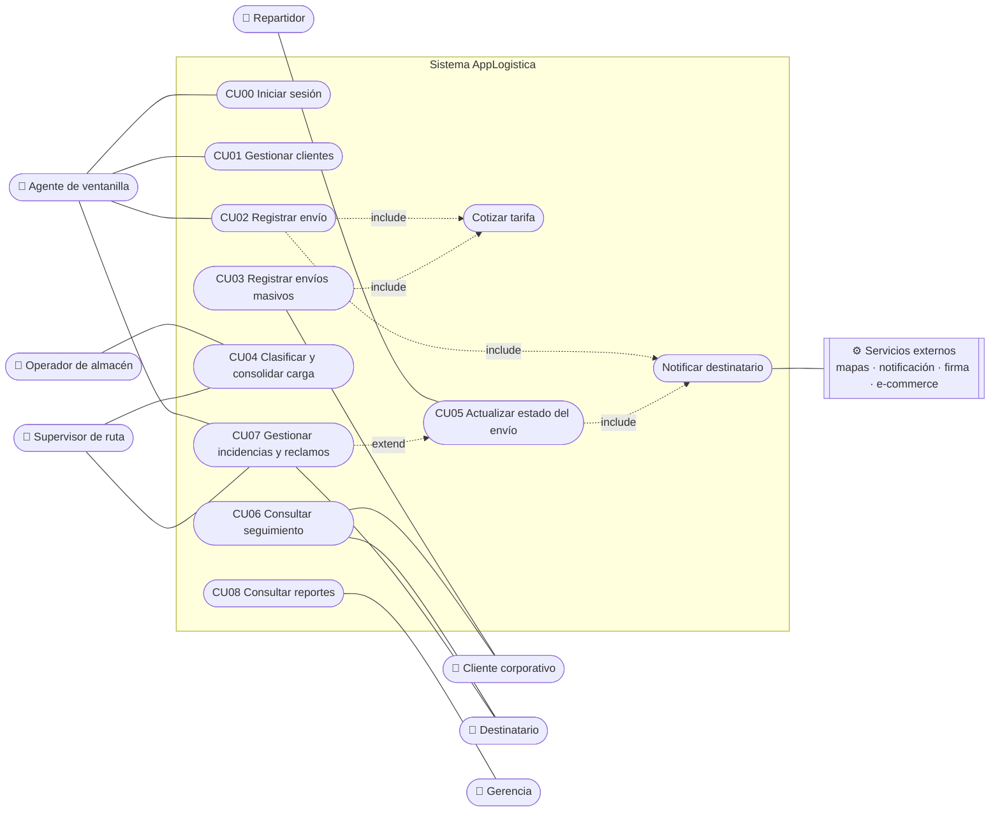
```mermaid
flowchart LR
    AV(["👤 Agente de ventanilla"])
    CC(["👤 Cliente corporativo"])
    OA(["👤 Operador de almacén"])
    RP(["👤 Repartidor"])
    SR(["👤 Supervisor de ruta"])
    DE(["👤 Destinatario"])
    GE(["👤 Gerencia"])
    EXT[["⚙ Servicios externos<br/>mapas · notificación · firma · e-commerce"]]

    subgraph SIS["Sistema AppLogistica"]
        direction TB
        CU00(["CU00 Iniciar sesión"])
        CU01(["CU01 Gestionar clientes"])
        CU02(["CU02 Registrar envío"])
        CU09(["Cotizar tarifa"])
        CU03(["CU03 Registrar envíos masivos"])
        CU04(["CU04 Clasificar y consolidar carga"])
        CU05(["CU05 Actualizar estado del envío"])
        CU10(["Notificar destinatario"])
        CU07(["CU07 Gestionar incidencias y reclamos"])
        CU06(["CU06 Consultar seguimiento"])
        CU08(["CU08 Consultar reportes"])
    end

    AV --- CU00
    AV --- CU01
    AV --- CU02
    AV --- CU07
    OA --- CU04
    SR --- CU04
    SR --- CU07
    RP --- CU05
    CU03 --- CC
    CU06 --- CC
    CU06 --- DE
    CU07 --- DE
    CU08 --- GE
    CU10 --- EXT
    CU02 -. include .-> CU09
    CU03 -. include .-> CU09
    CU02 -. include .-> CU10
    CU05 -. include .-> CU10
    CU07 -. extend .-> CU05
```

## d04_paquetes | Arquitectura en capas y paquetes de AppLogistica
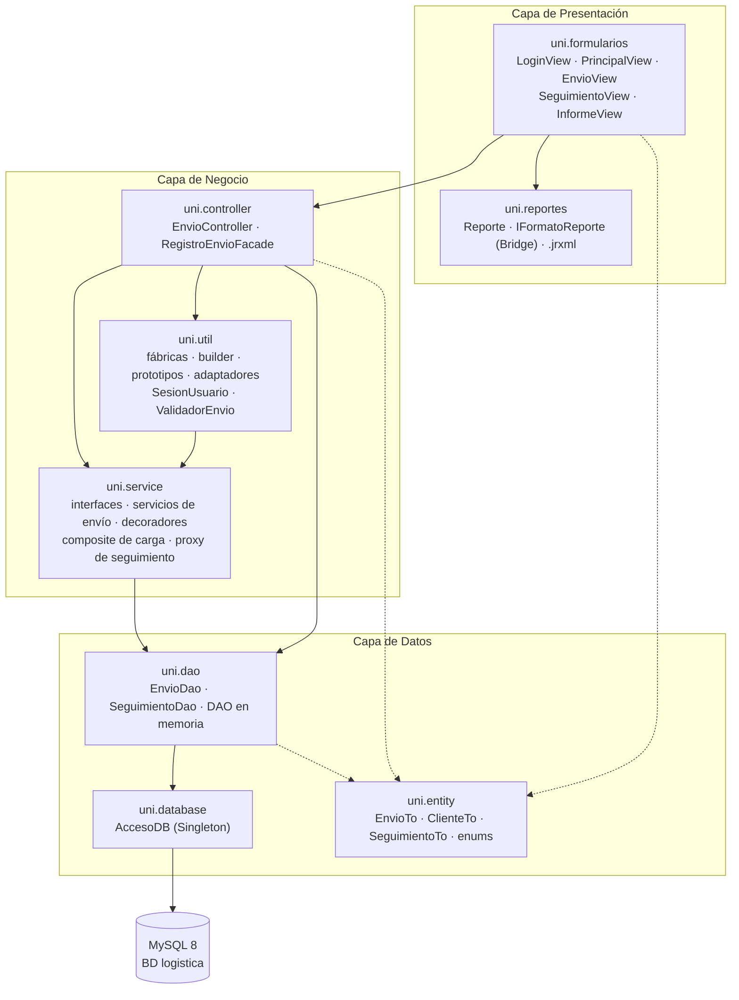
```mermaid
flowchart TB
    subgraph P["Capa de Presentación"]
        F["uni.formularios<br/>LoginView · PrincipalView · EnvioView<br/>SeguimientoView · InformeView"]
        RE["uni.reportes<br/>Reporte · IFormatoReporte (Bridge) · .jrxml"]
    end
    subgraph N["Capa de Negocio"]
        C["uni.controller<br/>EnvioController · RegistroEnvioFacade"]
        S["uni.service<br/>interfaces · servicios de envío · decoradores<br/>composite de carga · proxy de seguimiento"]
        U["uni.util<br/>fábricas · builder · prototipos · adaptadores<br/>SesionUsuario · ValidadorEnvio"]
    end
    subgraph D["Capa de Datos"]
        DAO["uni.dao<br/>EnvioDao · SeguimientoDao · DAO en memoria"]
        DB["uni.database<br/>AccesoDB (Singleton)"]
        E["uni.entity<br/>EnvioTo · ClienteTo · SeguimientoTo · enums"]
    end
    MYSQL[("MySQL 8<br/>BD logistica")]
    F --> C
    F --> RE
    C --> S
    C --> U
    U --> S
    S --> DAO
    C --> DAO
    DAO --> DB
    DB --> MYSQL
    F -.-> E
    C -.-> E
    DAO -.-> E
```

## d05_srp | SRP: separación de responsabilidades del registro de envío
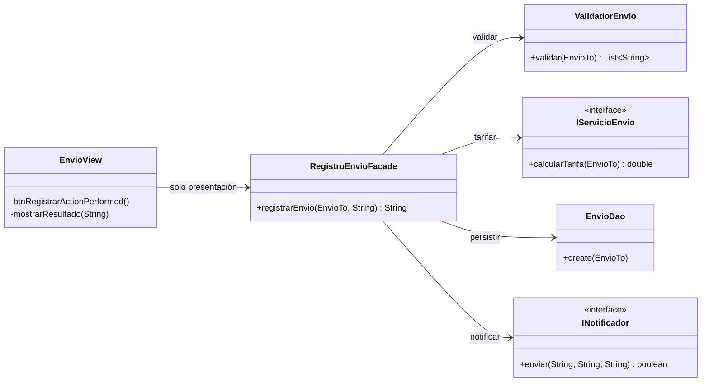
```mermaid
classDiagram
    direction LR
    class EnvioView {
        -btnRegistrarActionPerformed()
        -mostrarResultado(String)
    }
    class RegistroEnvioFacade {
        +registrarEnvio(EnvioTo, String) String
    }
    class ValidadorEnvio {
        +validar(EnvioTo) List~String~
    }
    class IServicioEnvio {
        <<interface>>
        +calcularTarifa(EnvioTo) double
    }
    class EnvioDao {
        +create(EnvioTo)
    }
    class INotificador {
        <<interface>>
        +enviar(String, String, String) boolean
    }
    EnvioView --> RegistroEnvioFacade : solo presentación
    RegistroEnvioFacade --> ValidadorEnvio : validar
    RegistroEnvioFacade --> IServicioEnvio : tarifar
    RegistroEnvioFacade --> EnvioDao : persistir
    RegistroEnvioFacade --> INotificador : notificar
```

## d06_ocp_lsp | OCP y LSP: jerarquía de servicios de envío
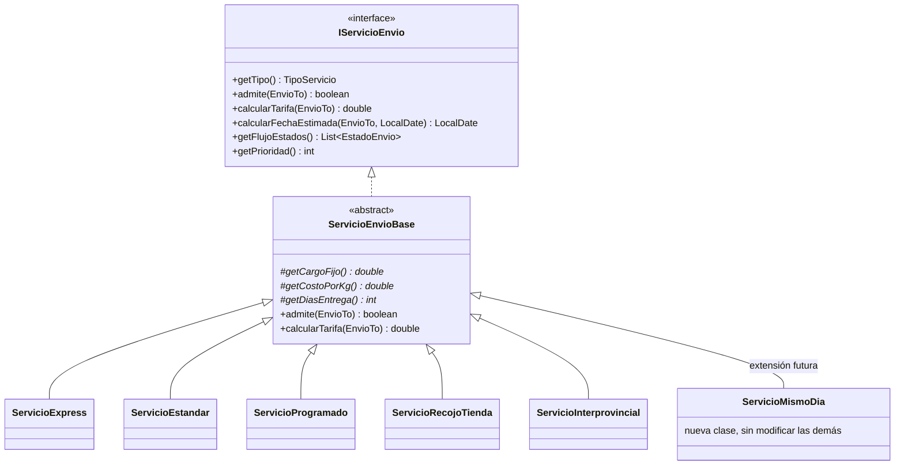
```mermaid
classDiagram
    class IServicioEnvio {
        <<interface>>
        +getTipo() TipoServicio
        +admite(EnvioTo) boolean
        +calcularTarifa(EnvioTo) double
        +calcularFechaEstimada(EnvioTo, LocalDate) LocalDate
        +getFlujoEstados() List~EstadoEnvio~
        +getPrioridad() int
    }
    class ServicioEnvioBase {
        <<abstract>>
        #getCargoFijo()* double
        #getCostoPorKg()* double
        #getDiasEntrega()* int
        +admite(EnvioTo) boolean
        +calcularTarifa(EnvioTo) double
    }
    IServicioEnvio <|.. ServicioEnvioBase
    ServicioEnvioBase <|-- ServicioExpress
    ServicioEnvioBase <|-- ServicioEstandar
    ServicioEnvioBase <|-- ServicioProgramado
    ServicioEnvioBase <|-- ServicioRecojoTienda
    ServicioEnvioBase <|-- ServicioInterprovincial
    ServicioEnvioBase <|-- ServicioMismoDia : extensión futura
    class ServicioMismoDia {
        nueva clase, sin modificar las demás
    }
```

## d07_isp | ISP: segregación de interfaces de acceso a datos
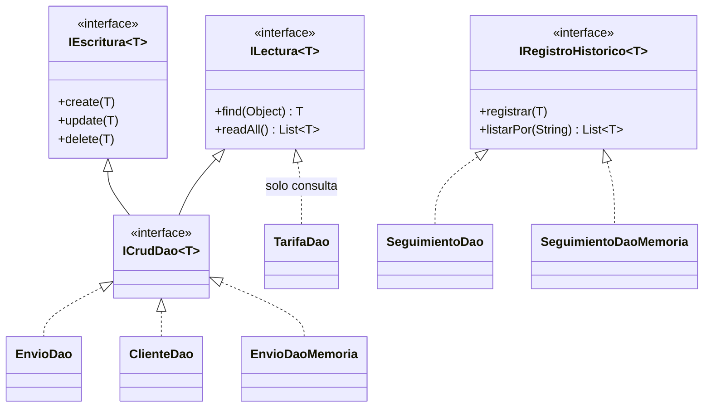
```mermaid
classDiagram
    class ILectura~T~ {
        <<interface>>
        +find(Object) T
        +readAll() List~T~
    }
    class IEscritura~T~ {
        <<interface>>
        +create(T)
        +update(T)
        +delete(T)
    }
    class ICrudDao~T~ {
        <<interface>>
    }
    class IRegistroHistorico~T~ {
        <<interface>>
        +registrar(T)
        +listarPor(String) List~T~
    }
    ILectura <|-- ICrudDao
    IEscritura <|-- ICrudDao
    ICrudDao <|.. EnvioDao
    ICrudDao <|.. ClienteDao
    ICrudDao <|.. EnvioDaoMemoria
    IRegistroHistorico <|.. SeguimientoDao
    IRegistroHistorico <|.. SeguimientoDaoMemoria
    ILectura <|.. TarifaDao : solo consulta
```

## d08_dip | DIP: el controlador depende de abstracciones
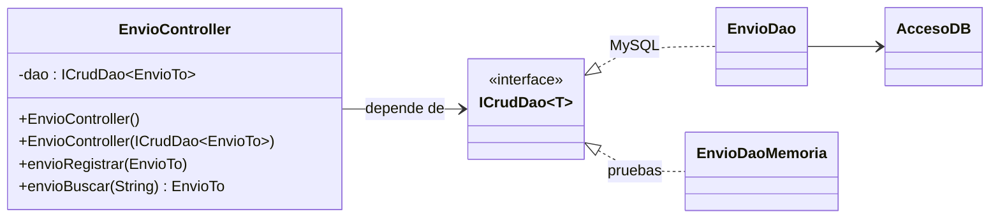
```mermaid
classDiagram
    direction LR
    class EnvioController {
        -dao : ICrudDao~EnvioTo~
        +EnvioController()
        +EnvioController(ICrudDao~EnvioTo~)
        +envioRegistrar(EnvioTo)
        +envioBuscar(String) EnvioTo
    }
    class ICrudDao~T~ {
        <<interface>>
    }
    EnvioController --> ICrudDao : depende de
    ICrudDao <|.. EnvioDao : MySQL
    ICrudDao <|.. EnvioDaoMemoria : pruebas
    EnvioDao --> AccesoDB
```

## d09_singleton | Patrón Singleton: AccesoDB y SesionUsuario
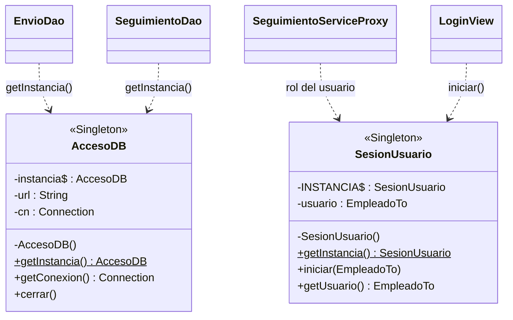
```mermaid
classDiagram
    class AccesoDB {
        <<Singleton>>
        -instancia$ : AccesoDB
        -url : String
        -cn : Connection
        -AccesoDB()
        +getInstancia()$ AccesoDB
        +getConexion() Connection
        +cerrar()
    }
    class SesionUsuario {
        <<Singleton>>
        -INSTANCIA$ : SesionUsuario
        -usuario : EmpleadoTo
        -SesionUsuario()
        +getInstancia()$ SesionUsuario
        +iniciar(EmpleadoTo)
        +getUsuario() EmpleadoTo
    }
    EnvioDao ..> AccesoDB : getInstancia()
    SeguimientoDao ..> AccesoDB : getInstancia()
    SeguimientoServiceProxy ..> SesionUsuario : rol del usuario
    LoginView ..> SesionUsuario : iniciar()
```

## d10_factory | Patrón Factory: creación de servicios de envío
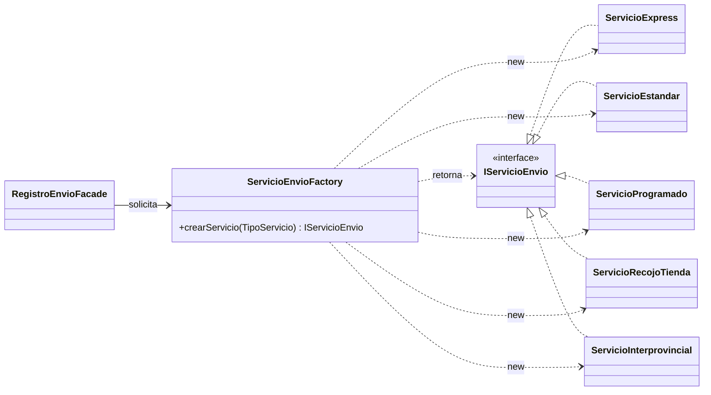
```mermaid
classDiagram
    direction LR
    class ServicioEnvioFactory {
        +crearServicio(TipoServicio) IServicioEnvio
    }
    class IServicioEnvio {
        <<interface>>
    }
    RegistroEnvioFacade --> ServicioEnvioFactory : solicita
    ServicioEnvioFactory ..> IServicioEnvio : retorna
    IServicioEnvio <|.. ServicioExpress
    IServicioEnvio <|.. ServicioEstandar
    IServicioEnvio <|.. ServicioProgramado
    IServicioEnvio <|.. ServicioRecojoTienda
    IServicioEnvio <|.. ServicioInterprovincial
    ServicioEnvioFactory ..> ServicioExpress : new
    ServicioEnvioFactory ..> ServicioEstandar : new
    ServicioEnvioFactory ..> ServicioProgramado : new
    ServicioEnvioFactory ..> ServicioRecojoTienda : new
    ServicioEnvioFactory ..> ServicioInterprovincial : new
```

## d11_abstract_factory | Patrón Abstract Factory: familias de integraciones
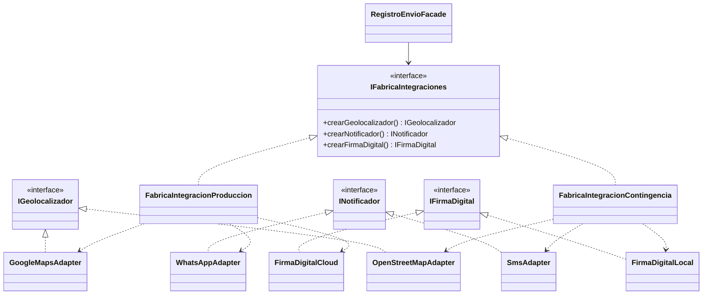
```mermaid
classDiagram
    class IFabricaIntegraciones {
        <<interface>>
        +crearGeolocalizador() IGeolocalizador
        +crearNotificador() INotificador
        +crearFirmaDigital() IFirmaDigital
    }
    class IGeolocalizador {
        <<interface>>
    }
    class INotificador {
        <<interface>>
    }
    class IFirmaDigital {
        <<interface>>
    }
    IFabricaIntegraciones <|.. FabricaIntegracionProduccion
    IFabricaIntegraciones <|.. FabricaIntegracionContingencia
    IGeolocalizador <|.. GoogleMapsAdapter
    IGeolocalizador <|.. OpenStreetMapAdapter
    INotificador <|.. WhatsAppAdapter
    INotificador <|.. SmsAdapter
    IFirmaDigital <|.. FirmaDigitalCloud
    IFirmaDigital <|.. FirmaDigitalLocal
    FabricaIntegracionProduccion ..> GoogleMapsAdapter
    FabricaIntegracionProduccion ..> WhatsAppAdapter
    FabricaIntegracionProduccion ..> FirmaDigitalCloud
    FabricaIntegracionContingencia ..> OpenStreetMapAdapter
    FabricaIntegracionContingencia ..> SmsAdapter
    FabricaIntegracionContingencia ..> FirmaDigitalLocal
    RegistroEnvioFacade --> IFabricaIntegraciones
```

## d12_builder | Patrón Builder: construcción de EnvioTo
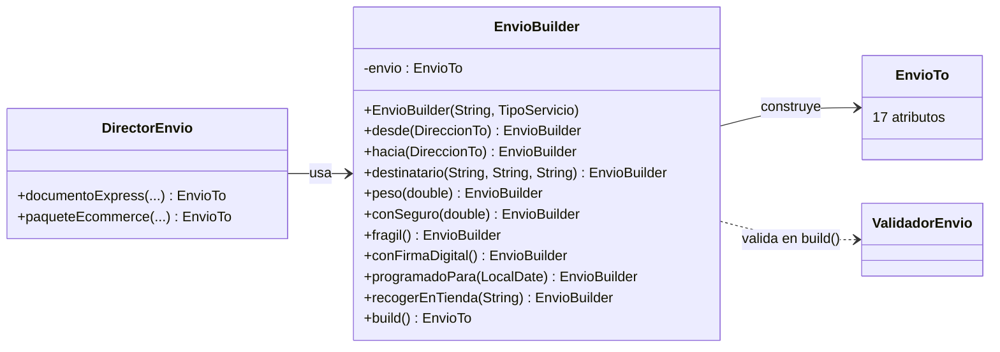
```mermaid
classDiagram
    direction LR
    class DirectorEnvio {
        +documentoExpress(...) EnvioTo
        +paqueteEcommerce(...) EnvioTo
    }
    class EnvioBuilder {
        -envio : EnvioTo
        +EnvioBuilder(String, TipoServicio)
        +desde(DireccionTo) EnvioBuilder
        +hacia(DireccionTo) EnvioBuilder
        +destinatario(String, String, String) EnvioBuilder
        +peso(double) EnvioBuilder
        +conSeguro(double) EnvioBuilder
        +fragil() EnvioBuilder
        +conFirmaDigital() EnvioBuilder
        +programadoPara(LocalDate) EnvioBuilder
        +recogerEnTienda(String) EnvioBuilder
        +build() EnvioTo
    }
    class EnvioTo {
        17 atributos
    }
    DirectorEnvio --> EnvioBuilder : usa
    EnvioBuilder --> EnvioTo : construye
    EnvioBuilder ..> ValidadorEnvio : valida en build()
```

## d13_prototype | Patrón Prototype: plantillas de envío corporativo
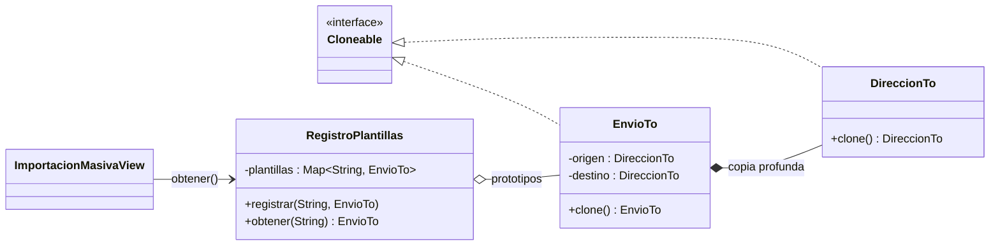
```mermaid
classDiagram
    direction LR
    class Cloneable {
        <<interface>>
    }
    class EnvioTo {
        -origen : DireccionTo
        -destino : DireccionTo
        +clone() EnvioTo
    }
    class DireccionTo {
        +clone() DireccionTo
    }
    class RegistroPlantillas {
        -plantillas : Map~String, EnvioTo~
        +registrar(String, EnvioTo)
        +obtener(String) EnvioTo
    }
    Cloneable <|.. EnvioTo
    Cloneable <|.. DireccionTo
    EnvioTo *-- DireccionTo : copia profunda
    RegistroPlantillas o-- EnvioTo : prototipos
    ImportacionMasivaView --> RegistroPlantillas : obtener()
```

## d14_adapter | Patrón Adapter: proveedores de notificación
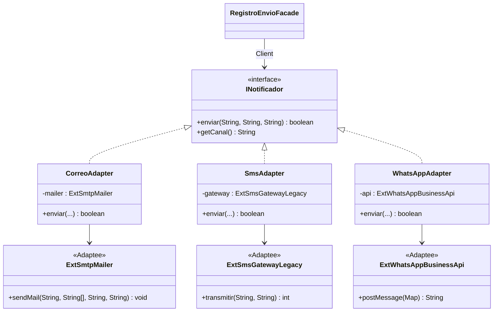
```mermaid
classDiagram
    class INotificador {
        <<interface>>
        +enviar(String, String, String) boolean
        +getCanal() String
    }
    class CorreoAdapter {
        -mailer : ExtSmtpMailer
        +enviar(...) boolean
    }
    class SmsAdapter {
        -gateway : ExtSmsGatewayLegacy
        +enviar(...) boolean
    }
    class WhatsAppAdapter {
        -api : ExtWhatsAppBusinessApi
        +enviar(...) boolean
    }
    class ExtSmtpMailer {
        <<Adaptee>>
        +sendMail(String, String[], String, String) void
    }
    class ExtSmsGatewayLegacy {
        <<Adaptee>>
        +transmitir(String, String) int
    }
    class ExtWhatsAppBusinessApi {
        <<Adaptee>>
        +postMessage(Map) String
    }
    RegistroEnvioFacade --> INotificador : Client
    INotificador <|.. CorreoAdapter
    INotificador <|.. SmsAdapter
    INotificador <|.. WhatsAppAdapter
    CorreoAdapter --> ExtSmtpMailer
    SmsAdapter --> ExtSmsGatewayLegacy
    WhatsAppAdapter --> ExtWhatsAppBusinessApi
```

## d15_facade | Patrón Facade: registro de envío
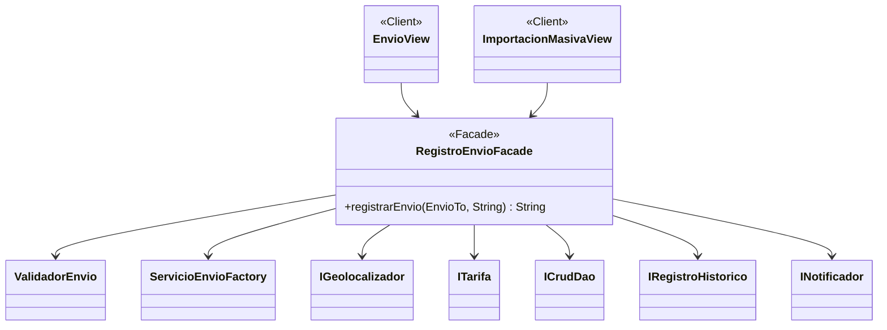
```mermaid
classDiagram
    class EnvioView {
        <<Client>>
    }
    class ImportacionMasivaView {
        <<Client>>
    }
    class RegistroEnvioFacade {
        <<Facade>>
        +registrarEnvio(EnvioTo, String) String
    }
    EnvioView --> RegistroEnvioFacade
    ImportacionMasivaView --> RegistroEnvioFacade
    RegistroEnvioFacade --> ValidadorEnvio
    RegistroEnvioFacade --> ServicioEnvioFactory
    RegistroEnvioFacade --> IGeolocalizador
    RegistroEnvioFacade --> ITarifa
    RegistroEnvioFacade --> ICrudDao
    RegistroEnvioFacade --> IRegistroHistorico
    RegistroEnvioFacade --> INotificador
```

## d15b_facade_secuencia | Secuencia de registrarEnvio() en la fachada
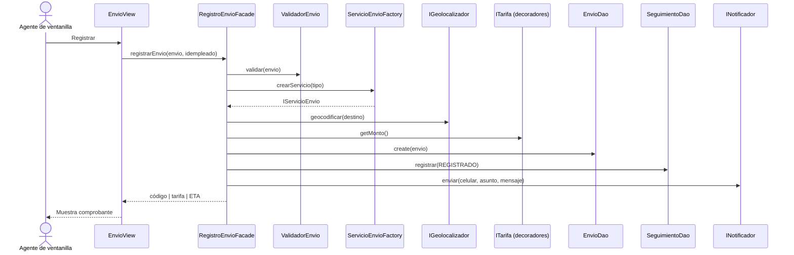
```mermaid
sequenceDiagram
    actor AV as Agente de ventanilla
    participant V as EnvioView
    participant F as RegistroEnvioFacade
    participant VA as ValidadorEnvio
    participant FA as ServicioEnvioFactory
    participant G as IGeolocalizador
    participant T as ITarifa (decoradores)
    participant D as EnvioDao
    participant H as SeguimientoDao
    participant N as INotificador
    AV->>V: Registrar
    V->>F: registrarEnvio(envio, idempleado)
    F->>VA: validar(envio)
    F->>FA: crearServicio(tipo)
    FA-->>F: IServicioEnvio
    F->>G: geocodificar(destino)
    F->>T: getMonto()
    F->>D: create(envio)
    F->>H: registrar(REGISTRADO)
    F->>N: enviar(celular, asunto, mensaje)
    F-->>V: código | tarifa | ETA
    V-->>AV: Muestra comprobante
```

## d16_decorator | Patrón Decorator: tarifa con servicios adicionales
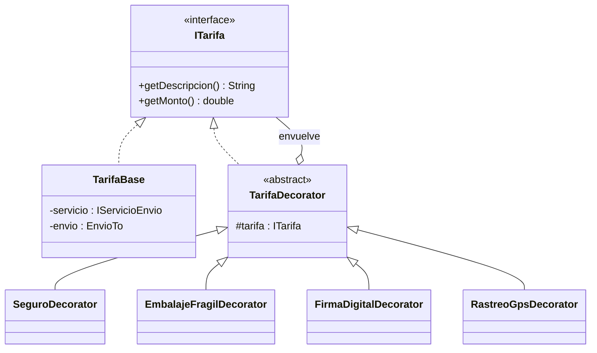
```mermaid
classDiagram
    class ITarifa {
        <<interface>>
        +getDescripcion() String
        +getMonto() double
    }
    class TarifaBase {
        -servicio : IServicioEnvio
        -envio : EnvioTo
    }
    class TarifaDecorator {
        <<abstract>>
        #tarifa : ITarifa
    }
    ITarifa <|.. TarifaBase
    ITarifa <|.. TarifaDecorator
    TarifaDecorator o-- ITarifa : envuelve
    TarifaDecorator <|-- SeguroDecorator
    TarifaDecorator <|-- EmbalajeFragilDecorator
    TarifaDecorator <|-- FirmaDigitalDecorator
    TarifaDecorator <|-- RastreoGpsDecorator
```

## d17_composite | Patrón Composite: consolidación de carga
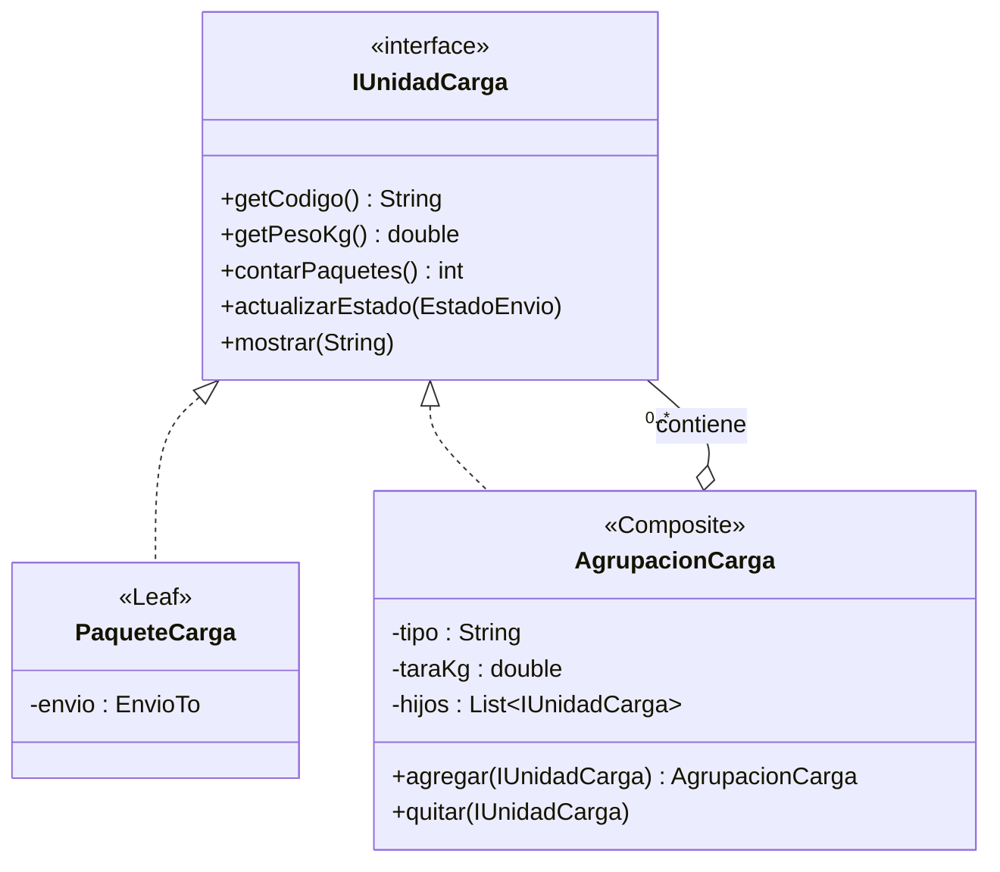
```mermaid
classDiagram
    class IUnidadCarga {
        <<interface>>
        +getCodigo() String
        +getPesoKg() double
        +contarPaquetes() int
        +actualizarEstado(EstadoEnvio)
        +mostrar(String)
    }
    class PaqueteCarga {
        <<Leaf>>
        -envio : EnvioTo
    }
    class AgrupacionCarga {
        <<Composite>>
        -tipo : String
        -taraKg : double
        -hijos : List~IUnidadCarga~
        +agregar(IUnidadCarga) AgrupacionCarga
        +quitar(IUnidadCarga)
    }
    IUnidadCarga <|.. PaqueteCarga
    IUnidadCarga <|.. AgrupacionCarga
    AgrupacionCarga o-- "0..*" IUnidadCarga : contiene
```

## d17b_composite_arbol | Árbol de carga del manifiesto MF-2026-0458
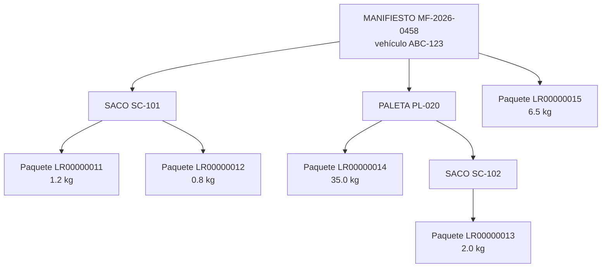
```mermaid
flowchart TB
    MF["MANIFIESTO MF-2026-0458<br/>vehículo ABC-123"]
    SC1["SACO SC-101"]
    PL["PALETA PL-020"]
    SC2["SACO SC-102"]
    P11["Paquete LR00000011<br/>1.2 kg"]
    P12["Paquete LR00000012<br/>0.8 kg"]
    P13["Paquete LR00000013<br/>2.0 kg"]
    P14["Paquete LR00000014<br/>35.0 kg"]
    P15["Paquete LR00000015<br/>6.5 kg"]
    MF --> SC1
    MF --> PL
    MF --> P15
    SC1 --> P11
    SC1 --> P12
    PL --> P14
    PL --> SC2
    SC2 --> P13
```

## d18_proxy | Patrón Proxy: control de acceso al seguimiento
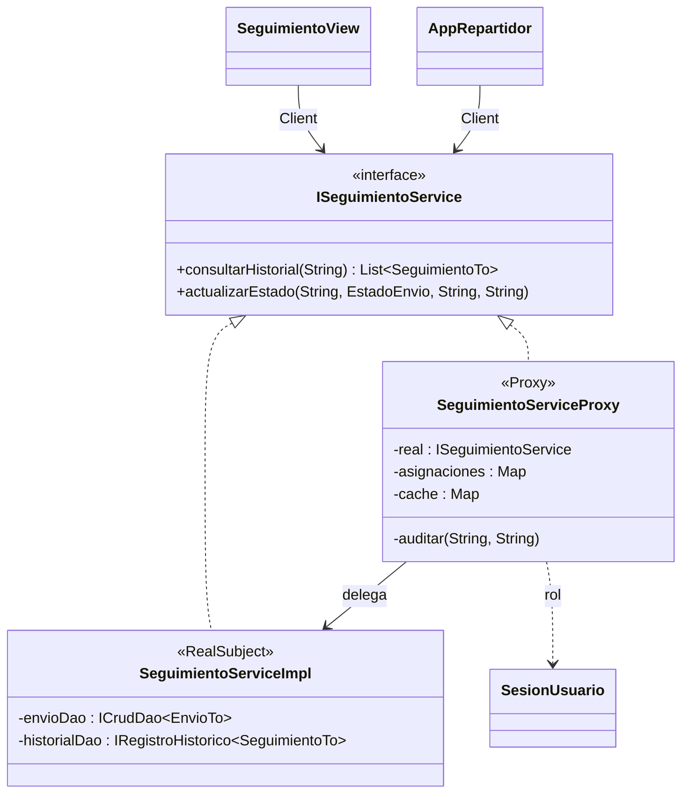
```mermaid
classDiagram
    class ISeguimientoService {
        <<interface>>
        +consultarHistorial(String) List~SeguimientoTo~
        +actualizarEstado(String, EstadoEnvio, String, String)
    }
    class SeguimientoServiceImpl {
        <<RealSubject>>
        -envioDao : ICrudDao~EnvioTo~
        -historialDao : IRegistroHistorico~SeguimientoTo~
    }
    class SeguimientoServiceProxy {
        <<Proxy>>
        -real : ISeguimientoService
        -asignaciones : Map
        -cache : Map
        -auditar(String, String)
    }
    SeguimientoView --> ISeguimientoService : Client
    AppRepartidor --> ISeguimientoService : Client
    ISeguimientoService <|.. SeguimientoServiceImpl
    ISeguimientoService <|.. SeguimientoServiceProxy
    SeguimientoServiceProxy --> SeguimientoServiceImpl : delega
    SeguimientoServiceProxy ..> SesionUsuario : rol
```

## d19_bridge | Patrón Bridge: reportes × formatos de salida
```mermaid
classDiagram
    class Reporte {
        <<abstract>>
        #formato : IFormatoReporte
        +setFormato(IFormatoReporte)
        +generar() String
        #getTitulo()* String
        #escribirContenido()*
    }
    class IFormatoReporte {
        <<interface>>
        +iniciar(String)
        +encabezado(String...)
        +fila(Object...)
        +finalizar() String
    }
    Reporte o-- IFormatoReporte : puente
    Reporte <|-- ReporteIncidenciasZona
    Reporte <|-- ReporteCumplimientoTiempos
    Reporte <|-- ReporteProductividadReparto
    IFormatoReporte <|.. FormatoPantalla
    IFormatoReporte <|.. FormatoCsv
    IFormatoReporte <|.. FormatoPdfJasper
```

## d20_er | Modelo lógico de la base de datos logistica (actualizado al Avance 2)
```mermaid
erDiagram
    clientes ||--o{ envios : registra
    tipos_servicio ||--o{ envios : clasifica
    direcciones ||--o{ envios : "origen/destino"
    zonas ||--o{ envios : "zona destino"
    sucursales ||--o{ zonas : atiende
    sucursales ||--o{ empleados : labora
    envios ||--o{ envio_adicionales : tiene
    servicios_adicionales ||--o{ envio_adicionales : aplica
    envios ||--o{ seguimientos : "historial"
    envios ||--o{ incidencias : presenta
    envios ||--o{ reclamos : origina
    envios ||--o{ notificaciones : genera
    envios ||--o{ alertas : dispara
    envios ||--o{ comandos_log : "acciones"
    empleados ||--o{ comandos_log : ejecuta
    envios ||--o{ unidad_detalle : "va en"
    unidades_carga ||--o{ unidad_detalle : contiene
    unidades_carga ||--o{ unidades_carga : "padre-hijo"
    rutas ||--o{ unidades_carga : transporta
    vehiculos ||--o{ rutas : usa
    zonas ||--o{ rutas : cubre
    empleados ||--o{ asignaciones : reparte
    envios ||--o{ asignaciones : asignado
    empleados ||--o{ seguimientos : registra
    envios {
        CHAR codigo PK
        CHAR idcliente FK
        VARCHAR idservicio FK
        ENUM estado
        TINYINT paso_flujo
        TINYINT intentos
        DECIMAL costo
        DATE fecha_estimada
    }
    seguimientos {
        BIGINT idseguimiento PK
        CHAR codigo FK
        VARCHAR estado
        DATETIME fechahora
    }
    alertas {
        BIGINT idalerta PK
        CHAR codigo FK
        ENUM nivel
        TINYINT atendida
    }
    comandos_log {
        BIGINT idcomando PK
        CHAR codigo FK
        VARCHAR comando
        VARCHAR estado_previo
        TINYINT deshecho
    }
```

# Capítulo VI – Patrones de comportamiento

## d21_comportamiento | Colaboración de los patrones de comportamiento en AppLogistica
```mermaid
flowchart TB
    V["SeguimientoView /<br/>ManifiestoView"] -- "crea comando" --> GC["GestorComandos<br/>(Invoker)"]
    GC -- "ejecutar() / deshacer()" --> CMD["IComando<br/>(Command)"]
    CMD -- "1. crearPuntoRestauracion()" --> PX["SeguimientoServiceProxy<br/>(Proxy)"]
    CMD -- "2. actualizarEstado()" --> PX
    PX --> RS["SeguimientoServiceImpl"]
    RS -- "cargarContexto()" --> CTX["EnvioContexto<br/>Context · Subject · Originator"]
    CTX -- "delega acción" --> ST["IEstadoEnvio<br/>(State)"]
    CTX -- "crearMemento()" --> M["EnvioMemento<br/>(Memento)"]
    M -. "guardado por" .-> CMD
    CTX -- "notificar(evento)" --> OBS["IObservadorEnvio<br/>(Observer)"]
    OBS --> O1["Persistencia del envío"]
    OBS --> O2["Historial de seguimiento"]
    OBS --> O3["Notificación al destinatario<br/>(Adapter)"]
    OBS --> O4["Alertas a supervisores"]
    OBS --> O5["Indicadores / Pantalla"]
```

## d22_observer | Patrón Observer: reacciones ante el cambio de estado de un envío
```mermaid
classDiagram
    direction LR
    class ISujetoEnvio {
        <<interface>>
        +suscribir(IObservadorEnvio)
        +desuscribir(IObservadorEnvio)
        +notificar(EventoEnvio)
    }
    class IObservadorEnvio {
        <<interface>>
        +actualizar(EventoEnvio)
        +getNombre() String
    }
    class EnvioContexto {
        <<ConcreteSubject>>
        -observadores : List~IObservadorEnvio~
        ~cambiarEstado(EstadoEnvio)
    }
    class EventoEnvio {
        -envio : EnvioTo
        -estadoAnterior : EstadoEnvio
        -estadoNuevo : EstadoEnvio
        -reversion : boolean
    }
    class PersistenciaEnvioObserver
    class HistorialSeguimientoObserver
    class NotificacionDestinatarioObserver {
        -notificador : INotificador
    }
    class AlertaSupervisorObserver
    class IndicadoresObserver
    class SeguimientoView
    ISujetoEnvio <|.. EnvioContexto
    EnvioContexto o--> "*" IObservadorEnvio
    EnvioContexto ..> EventoEnvio : crea
    IObservadorEnvio <|.. PersistenciaEnvioObserver
    IObservadorEnvio <|.. HistorialSeguimientoObserver
    IObservadorEnvio <|.. NotificacionDestinatarioObserver
    IObservadorEnvio <|.. AlertaSupervisorObserver
    IObservadorEnvio <|.. IndicadoresObserver
    IObservadorEnvio <|.. SeguimientoView
    NotificacionDestinatarioObserver --> INotificador : Adapter
```

## d22b_observer_secuencia | Secuencia: un cambio de estado notifica a todos los observadores
```mermaid
sequenceDiagram
    participant S as SeguimientoServiceImpl
    participant C as EnvioContexto
    participant E as EstadoEnRuta
    participant P as PersistenciaEnvioObserver
    participant H as HistorialSeguimientoObserver
    participant N as NotificacionDestinatarioObserver
    participant A as AlertaSupervisorObserver
    S->>C: ejecutar(OBSERVAR, ...)
    C->>E: observar(contexto)
    E->>C: registrarIntentoFallido()
    C->>C: cambiarEstado(OBSERVADO)
    C->>P: actualizar(evento)
    P-->>C: envios.estado = OBSERVADO
    C->>H: actualizar(evento)
    H-->>C: INSERT seguimientos
    C->>N: actualizar(evento)
    N-->>C: WhatsApp / SMS al destinatario
    C->>A: actualizar(evento)
    A-->>C: alerta ALTA o CRITICA
```

## d23_state | Patrón State: estados del ciclo de vida del envío
```mermaid
classDiagram
    direction LR
    class EnvioContexto {
        <<Context>>
        -estado : IEstadoEnvio
        -servicio : IServicioEnvio
        +ejecutar(AccionEnvio, ...)
        +accionesPermitidas() List
        ~avanzar(EstadoEnvio)
        ~flujoPermite(EstadoEnvio) boolean
    }
    class IEstadoEnvio {
        <<interface>>
        +recoger(EnvioContexto)
        +trasladar(EnvioContexto)
        +clasificar(EnvioContexto)
        +despachar(EnvioContexto)
        +entregar(EnvioContexto)
        +observar(EnvioContexto)
        +reprogramar(EnvioContexto, LocalDate)
        +devolver(EnvioContexto)
        +accionesPermitidas(EnvioContexto) List
    }
    class EstadoEnvioBase {
        <<abstract>>
        #prohibir(AccionEnvio)
    }
    EnvioContexto o--> IEstadoEnvio : estado actual
    EnvioContexto --> IServicioEnvio : flujo (Factory)
    IEstadoEnvio <|.. EstadoEnvioBase
    EstadoEnvioBase <|-- EstadoRegistrado
    EstadoEnvioBase <|-- EstadoRecogido
    EstadoEnvioBase <|-- EstadoEnTransito
    EstadoEnvioBase <|-- EstadoClasificado
    EstadoEnvioBase <|-- EstadoEnRuta
    EstadoEnvioBase <|-- EstadoObservado
    EstadoEnvioBase <|-- EstadoReprogramado
    EstadoEnvioBase <|-- EstadoEntregado
    EstadoEnvioBase <|-- EstadoDevuelto
    CatalogoEstados ..> IEstadoEnvio : de(EstadoEnvio)
```

## d23b_state_maquina | Máquina de estados implementada (acciones y condiciones)
```mermaid
stateDiagram-v2
    [*] --> REGISTRADO
    REGISTRADO --> RECOGIDO : recoger
    RECOGIDO --> EN_TRANSITO : trasladar [estándar, recojo tienda]
    RECOGIDO --> CLASIFICADO : clasificar [programado, interprovincial]
    RECOGIDO --> EN_RUTA : despachar [express]
    EN_TRANSITO --> CLASIFICADO : clasificar
    CLASIFICADO --> EN_TRANSITO : trasladar [interprovincial]
    CLASIFICADO --> EN_RUTA : despachar
    CLASIFICADO --> ENTREGADO : entregar [recojo tienda]
    EN_RUTA --> ENTREGADO : entregar [firma si se requiere]
    EN_RUTA --> OBSERVADO : observar / intentos++
    OBSERVADO --> REPROGRAMADO : reprogramar [intentos menor a 3]
    OBSERVADO --> DEVUELTO : devolver
    REPROGRAMADO --> EN_RUTA : despachar
    REPROGRAMADO --> DEVUELTO : devolver
    ENTREGADO --> [*]
    DEVUELTO --> [*]
```

## d24_command | Patrón Command: acciones operativas con deshacer y cola sin conexión
```mermaid
classDiagram
    class IComando {
        <<interface>>
        +ejecutar()
        +deshacer()
        +getDescripcion() String
    }
    class ComandoEnvioBase {
        <<abstract>>
        #receptor : ISeguimientoService
        -respaldo : EnvioMemento
        +ejecutar()
        +deshacer()
        #accion()*
    }
    class GestorComandos {
        <<Invoker>>
        -pilaDeshacer : Deque
        -pilaRehacer : Deque
        -pendientes : Deque
        +ejecutar(IComando)
        +deshacer()
        +rehacer()
        +encolar(IComando)
        +sincronizar() List
    }
    class MacroComando {
        -comandos : List~IComando~
    }
    class ISeguimientoService {
        <<Receiver>>
    }
    IComando <|.. ComandoEnvioBase
    IComando <|.. MacroComando
    ComandoEnvioBase <|-- ComandoCambiarEstado
    ComandoEnvioBase <|-- ComandoRegistrarIncidencia
    ComandoEnvioBase <|-- ComandoReprogramar
    ComandoEnvioBase <|-- ComandoConfirmarEntrega
    MacroComando o--> "*" IComando
    GestorComandos o--> "*" IComando
    GestorComandos --> IBitacoraComandos : comandos_log
    ComandoEnvioBase --> ISeguimientoService
    SeguimientoView ..> GestorComandos : Client
    ManifiestoView ..> MacroComando : Client
```

## d24b_command_secuencia | Secuencia: ejecutar y deshacer un comando
```mermaid
sequenceDiagram
    actor U as Operador
    participant V as SeguimientoView
    participant G as GestorComandos
    participant K as ComandoCambiarEstado
    participant P as SeguimientoServiceProxy
    participant C as EnvioContexto
    U->>V: clic en "Clasificar"
    V->>G: ejecutar(new ComandoCambiarEstado(...))
    G->>K: ejecutar()
    K->>P: crearPuntoRestauracion(codigo)
    P-->>K: EnvioMemento
    K->>P: actualizarEstado(codigo, CLASIFICADO)
    P->>C: estado.clasificar() + notificar()
    G->>G: pilaDeshacer.push(K) y comandos_log
    U->>V: clic en "Deshacer"
    V->>G: deshacer()
    G->>K: deshacer()
    K->>P: restaurar(codigo, memento)
    P->>C: restaurar(m) + notificar(reversión)
    G->>G: pilaRehacer.push(K) y deshecho = 1
```

## d25_memento | Patrón Memento: puntos de restauración del envío
```mermaid
classDiagram
    class EnvioContexto {
        <<Originator>>
        +crearMemento(String) EnvioMemento
        +restaurar(EnvioMemento, String, String)
    }
    class EnvioMemento {
        <<Memento>>
        -estado : EstadoEnvio
        -pasoFlujo : int
        -intentos : int
        -fechaProgramada : LocalDate
        -codigoFirma : String
        ~estado() EstadoEnvio
        +getEtiqueta() String
        +getResumen() String
    }
    class HistorialMementos {
        <<Caretaker>>
        -puntos : Map~String, Deque~
        +guardar(EnvioMemento)
        +ultimo(String) EnvioMemento
        +listar(String) List
    }
    class ComandoEnvioBase {
        <<Caretaker>>
        -respaldo : EnvioMemento
    }
    EnvioContexto ..> EnvioMemento : crea / lee
    HistorialMementos o--> "*" EnvioMemento
    ComandoEnvioBase o--> EnvioMemento
```

## d25b_memento_secuencia | Secuencia: cancelar una reprogramación con Memento
```mermaid
sequenceDiagram
    actor S as Supervisor
    participant V as SeguimientoView
    participant H as HistorialMementos
    participant P as ISeguimientoService
    participant C as EnvioContexto
    S->>V: Guardar punto "Antes de reprogramar"
    V->>P: crearPuntoRestauracion(codigo, etiqueta)
    P->>C: crearMemento(etiqueta)
    C-->>V: EnvioMemento
    V->>H: guardar(memento)
    S->>V: Reprogramar para nueva fecha
    S->>V: Restaurar punto seleccionado
    V->>H: listar(codigo)
    V->>P: restaurar(codigo, memento, motivo)
    P->>C: restaurar(memento)
    C->>C: notificar(evento de reversión)
```

## d26_empleado | State y Observer aplicados al estado laboral del empleado (Sesión 12)
```mermaid
classDiagram
    direction LR
    class EmpleadoContexto {
        <<Context / Subject>>
        -estado : IEstadoLaboral
        -observadores : List~IObservadorEmpleado~
        +ejecutar(accion, motivo)
        +mostrarEstado() String
        ~cambiarEstado(IEstadoLaboral)
    }
    class IEstadoLaboral {
        <<interface>>
        +puedeIniciarSesion() boolean
        +puedeRecibirEnvios() boolean
        +mostrarEstado(EmpleadoTo) String
        +enviarVacaciones(EmpleadoContexto)
        +reincorporar(EmpleadoContexto)
        +cesar(EmpleadoContexto)
    }
    class IObservadorEmpleado {
        <<interface>>
        +actualizar(EmpleadoTo, anterior, nuevo, motivo)
    }
    EmpleadoContexto o--> IEstadoLaboral
    EmpleadoContexto o--> "*" IObservadorEmpleado
    IEstadoLaboral <|.. EstadoLaboralBase
    EstadoLaboralBase <|-- EstadoLaboralActivo
    EstadoLaboralBase <|-- EstadoLaboralVacaciones
    EstadoLaboralBase <|-- EstadoLaboralInactivo
    IObservadorEmpleado <|.. RecursosHumanosObserver
    IObservadorEmpleado <|.. OperacionesObserver
    RecursosHumanosObserver --> historial_laboral : registra
    OperacionesObserver --> alertas : reasignar envíos
    EmpleadoController ..> EmpleadoContexto : login y cambios
```
